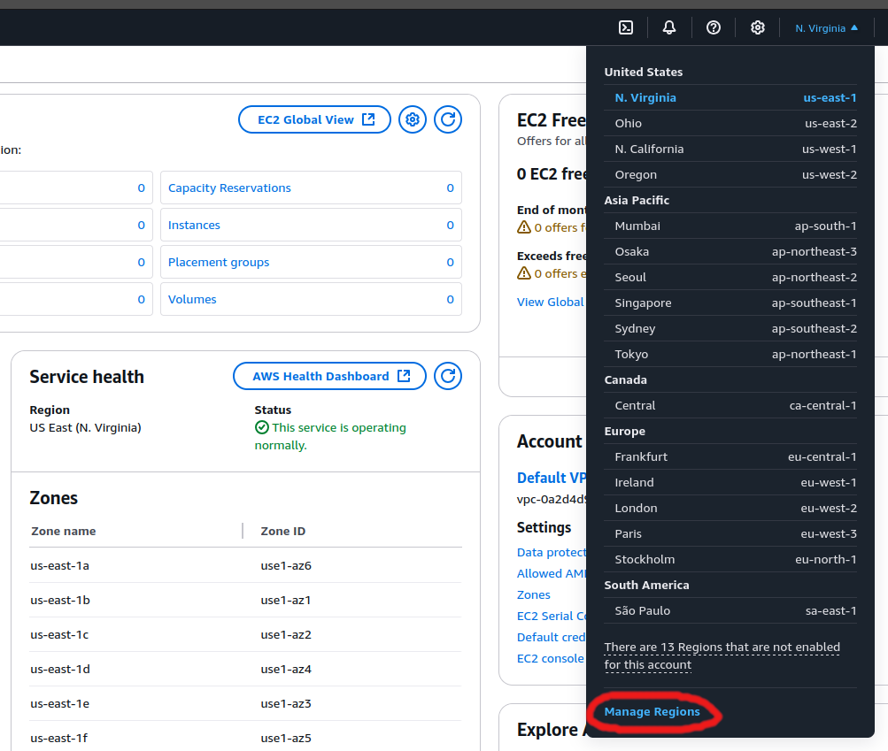

# Common issues

* [Increasing the Spot vCPU quotas](#increasing-the-spot-vcpu-quotas)
* [Enabling all AWS regions](#enabling-all-aws-regions)
* [Getting consistent CPU performance](#getting-consistent-cpu-performance)

## Increasing the Spot vCPU quotas

When starting to run more or bigger Spots, one will sooner or later run into `Max spot instance count exceeded` errors
as AWS is pretty conservative there by default. To fix go to the "Service Quotas" page in the web console and request
an increase.

Increasing the "Standard" (A, C, D, H, I, M, R, T, Z) instance families is good enough in most cases. More info on instance
families can be found from here: https://aws.amazon.com/ec2/instance-types/

PS don't forget that **quotas are per region!**

One can also check the Spot Quotas on the CLI, given one has the `ServiceQuotasReadOnlyAccess` policy or
`servicequotas:ListServiceQuotas` action granted.

```
aws service-quotas list-service-quotas --service-code ec2 --region eu-north-1 \
  --query Quotas"[?contains(not_null(QuotaName,''), 'Spot')].{QuotaName: QuotaName, Value: Value}"

[
    {
        "QuotaName": "All Standard (A, C, D, H, I, M, R, T, Z) Spot Instance Requests",
        "Value": 256.0
    },
    {
        "QuotaName": "All G and VT Spot Instance Requests",
        "Value": 0.0
    },
    {
        "QuotaName": "All F Spot Instance Requests",
        "Value": 64.0
    },
    {
        "QuotaName": "All DL Spot Instance Requests",
        "Value": 96.0
    },
    {
        "QuotaName": "All P4, P3 and P2 Spot Instance Requests",
        "Value": 0.0
    },
    {
        "QuotaName": "All Inf Spot Instance Requests",
        "Value": 8.0
    },
    {
        "QuotaName": "All Trn Spot Instance Requests",
        "Value": 0.0
    },
    {
        "QuotaName": "All X Spot Instance Requests",
        "Value": 8.0
    },
    {
        "QuotaName": "All P5 Spot Instance Requests",
        "Value": 0.0
    }
]
```

## Enabling all AWS regions

By default some AWS regions of interest might not be enabled, thus causing errors on launching (`--check-price` uses
publicly available data).

Listing not activated regions on the CLI:

```
aws ec2 describe-regions --filter Name=opt-in-status,Values=not-opted-in

# All regions
aws ec2 describe-regions --all-regions
```

To fix go to the the Web Console and "opt in":




## Getting consistent CPU performance

By default can happen that different VM incarnations use either ARM or x86 CPUs - and although ARM has generally
better performance for the price, in absolute terms mostly x86 wins for databases. If this becomes and issue one should
just fix the CPU architecture, by setting `--cpu-arch` (`CPU_ARCH`) or instance familes (`instance_family` / `INSTANCE_FAMILY`)
or just give a fixed list of preferred instances via `--instance-types`.

Any limiting of suitable instance types though can affect Spot saving possibilities.
